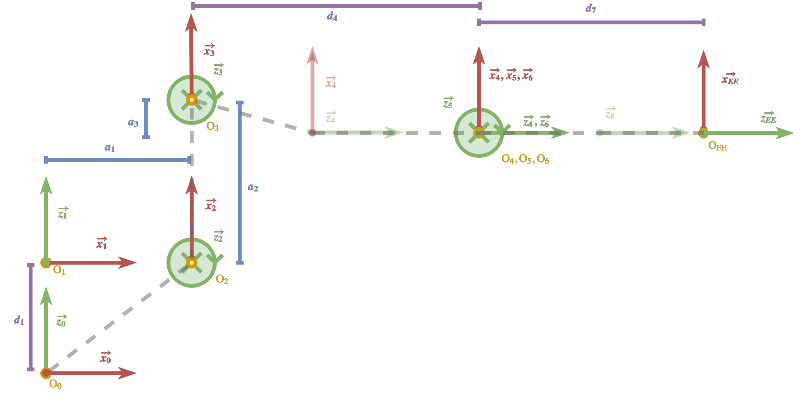
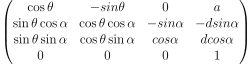
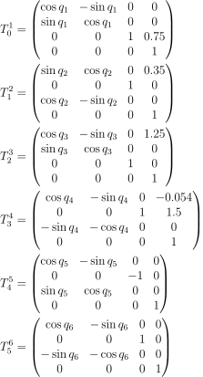
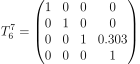
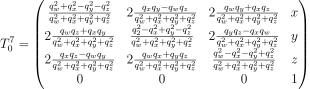
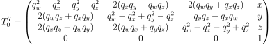
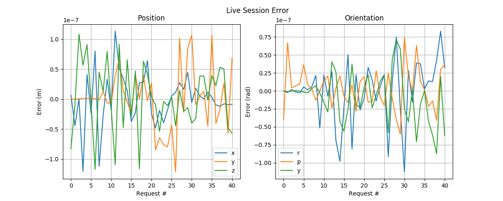

# Project: Kinematics Pick & Place

## Kinematic Analysis

I used the following frame/axes assignments in the kinematic analysis of the KUKA KR210 Robot Arm:



In the above diagram, note that &otimes; represents vector going *into* the page, or away from the viewer, whereas one shown as &#8857; (not used) might represent a vector coming *out of* the page, or towards the viewer. It is also noteworthy that the diagram is not drawn in scale.

Accordingly, we find the DH parameters of the KUKA arm to be as follows:

&alpha;   | a      | d    | &theta;
:--------:|:------:|:----:|:-------:
0         | 0      | 0.75 | q&#8321;
-&pi;/2   | 0.35   | 0    | q&#8322;-&pi;/2
0         | 1.25   | 0    | q&#8323;
-&pi;/2   | -0.054 | 1.50 | q&#8324;
&pi;/2    | 0      | 0    | q&#8325;
-&pi;/2   | 0      | 0    | q&#8326;
0         | 0      | 0.303| 0

These values are defined [here](kuka_kin.py#112).

### Angular Parameters

In order to obtain the twist, we simply examine the joint angles and their difference about the common normal at each position, as follows:

X&#7522; | &alpha; | Z&#7522; | Z&#7522;&#8330;&#8321;
:-------:|:-------:|:--------:|:----------------------:
&rarr;   | 0       | &uarr;   | &uarr;
&rarr;   | -&pi;/2 | &uarr;   | &otimes; 
&uarr;   | 0       | &otimes; | &otimes;
&uarr;   | -&pi;/2 | &otimes; | &rarr;
&uarr;   | &pi;/2  | &rarr;   | &otimes;
&uarr;   | -&pi;/2 | &otimes; | &rarr;

Namely, rotation about X&#7522; of angle &alpha; will align Z&#7522; with Z&#7522;&#8330;&#8321;.

As for obtaining &theta;, we can see from the above table that each &theta;&#7522; exactly correspond to q&#7522; (the joint angle) with the exception of &theta;&#8322;, where the relative rotation of X&#8322; from X&#8321; introduces an additional offset of -&pi;/2 from the joint angles to align X&#8322; with X&#8321;.

### Displacement Parameters

With the above definition (as from the figure), obtaining the displacements is straightforward.

Without laboring thorough all the details, here's an excerpt from [kr210.urdf.xacro](./kuka_arm/urdf/kr210.urdf.xacro):

```xml
<joint name="joint_1" type="revolute">
    <origin xyz="0 0 0.33" rpy="0 0 0"/>
    <parent link="base_link"/>
    <child link="link_1"/>
    <axis xyz="0 0 1"/>
    <limit lower="${-185*deg}" upper="${185*deg}" effort="300" velocity="${123*deg}" />
</joint>
<joint name="joint_2" type="revolute">
    <origin xyz="0.35 0 0.42" rpy="0 0 0"/>
    <parent link="link_1"/>
    <child link="link_2"/>
    <axis xyz="0 1 0"/>
    <limit lower="${-45*deg}" upper="${85*deg}" effort="300" velocity="${115*deg}"/>
</joint>
```

Here, it is simple to obtain a&#8321;=0.35, which is the radial distance of z&#8322; from z&#8321;.
As the joint axis of joint\_1 is along the z-axis, we can simply take the x-component of joint origin (since y=0) as the value of a&#8321;!

Whereas d&#8321; is not immediately visible, it is also quite simple to see how it would be obtained:

Since O&#8321; was translated to the same height as O&#8322; in order to simplify the DH parameters, the displacement is in fact the sum of the two displacements in the positive-z direction, i.e. 0.33+0.42=0.75. This is also consistent with what we have seen.

As a simple validation, I set the joint angles to zero and ran [fetch\_tf.py](./kuka_arm/scripts/fetch_tf.py) in order to see if the values from the tf transform matched. 
Note that frame origins were queried based on the ones assigned in DH conventions (illustrated above), rather than the ones specified in the URDF, for the most compact representation.

Sample output:
```bash
# To reproduce the results:
# roslaunch kuka_arm forward_kinematics.launch
# rosrun kuka_arm fetch_tf.py

===
d1 : 0.75
a1 : 0.35
a2 : 1.25
d4 : 1.5
a3 : -0.054
d7 : 0.303
===
...
```

It is straightforward to see that the values exactly correspond to the parameters reported in the table.

### Transformation Matrices

Given DH Parameters &alpha;, a, d, and &theta;, the following matrix represents the corresponding transformation:



In implementation, this is shown in [kuka\_kin.py](kuka_arm/scripts/kuka_kin.py#199) as a class method of `KUKAKin()`:
```python
@staticmethod
def dh2T(alpha, a, d, q):
    """ Convert DH Parameters to Transformation Matrix """
    cq = cos(q)
    sq = sin(q)
    ca = cos(alpha)
    sa = sin(alpha)

    T = Matrix([
        [cq, -sq, 0, a],
        [sq*ca, cq*ca, -sa, -sa*d],
        [sq*sa, cq*sa, ca, ca*d],
        [0, 0, 0, 1]
        ])
    return T
```

Accordingly, we find the individual transformation matrices to be as follows:



And the final (static) transformation to the gripper:



Assuming that the pose of the gripper is given as position `(x, y, z)` and orientation `(qw, qx, qy, qz)`, the composition of the matrices above would be equal to the homogeneous transform from base\_link to the gripper as:



(see [transformations.py](https://github.com/ros/geometry/blob/hydro-devel/tf/src/tf/transformations.py#L1174) for reference)

Assuming unit quaternion, this expression simplifies to:



### Inverse Kinematics

Given that the KR210 arm contains a *spherical wrist*, the inverse kinematics can be decomposed into two independent components: position (joints 1-3) and orientation (joints 4-6).

#### Inverse Position

#### Inverse Orientation

#### Error Characterization


## Project Implementation

#### Error Characterization


