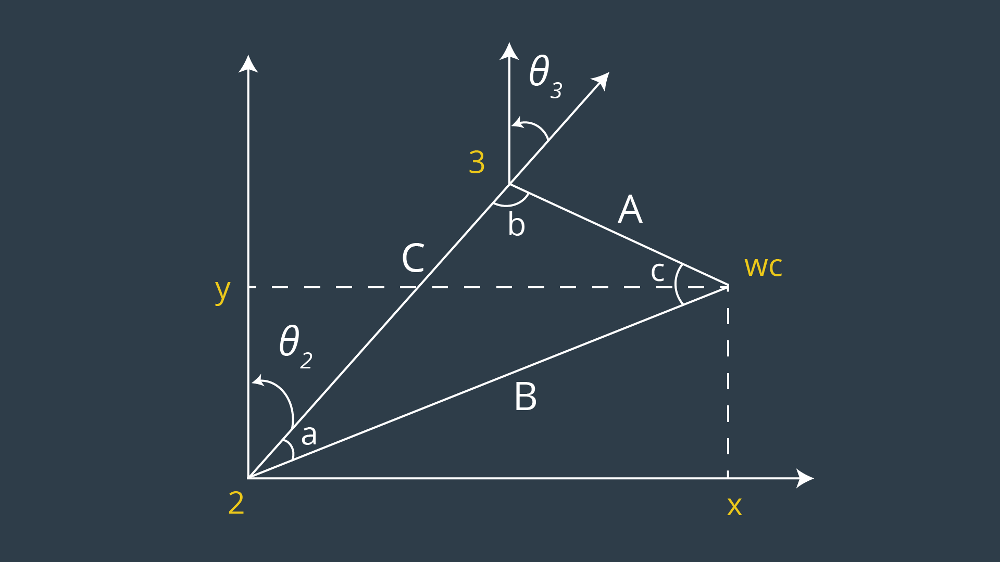
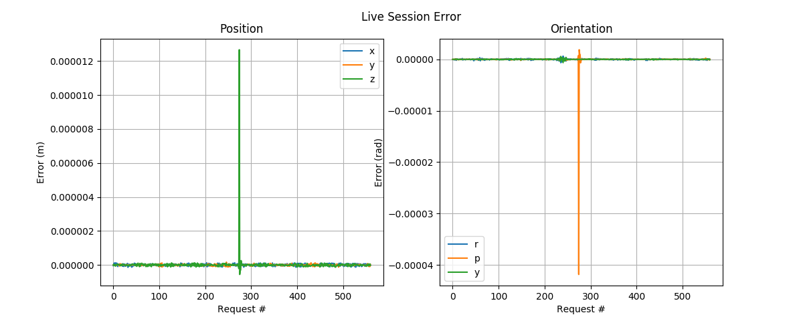

# Project: Kinematics Pick & Place


## Description

This project is the second project in the Udacity Robotics Software Nanodegree Term I.

In the project, we use a simulated robotic arm (KUKA KR210) to develop a simple inverse kinematics solution for a pick-and-place application.

## Kinematic Analysis

I used the following frame/axes assignments in the kinematic analysis of the KUKA KR210 Robot Arm:


In the above diagram, note that &otimes; represents vector going *into* the page, or away from the viewer, whereas one shown as &#8857; (not used) might represent a vector coming *out of* the page, or towards the viewer. It is also noteworthy that the diagram is not drawn in scale.

Accordingly, we find the DH parameters of the KUKA arm to be as follows:

&alpha;   | a      | d    | &theta;
:--------:|:------:|:----:|:-------:
0         | 0      | 0.75 | q&#8321;
-&pi;/2   | 0.35   | 0    | q&#8322;-&pi;/2
0         | 1.25   | 0    | q&#8323;
-&pi;/2   | -0.054 | 1.50 | q&#8324;
&pi;/2    | 0      | 0    | q&#8325;
-&pi;/2   | 0      | 0    | q&#8326;
0         | 0      | 0.303| 0

These values are defined [here](kuka_kin.py#112).

### Angular Parameters

In order to obtain the twist, we simply examine the joint angles and their difference about the common normal at each position, as follows:

X&#7522; | &alpha; | Z&#7522; | Z&#7522;&#8330;&#8321;
:-------:|:-------:|:--------:|:----------------------:
&rarr;   | 0       | &uarr;   | &uarr;
&rarr;   | -&pi;/2 | &uarr;   | &otimes; 
&uarr;   | 0       | &otimes; | &otimes;
&uarr;   | -&pi;/2 | &otimes; | &rarr;
&uarr;   | &pi;/2  | &rarr;   | &otimes;
&uarr;   | -&pi;/2 | &otimes; | &rarr;

Namely, rotation about X&#7522; of angle &alpha; will align Z&#7522; with Z&#7522;&#8330;&#8321;.

As for obtaining &theta;, we can see from the above table that each &theta;&#7522; exactly correspond to q&#7522; (the joint angle) with the exception of &theta;&#8322;, where the relative rotation of X&#8322; from X&#8321; introduces an additional offset of -&pi;/2 from the joint angles to align X&#8322; with X&#8321;.

### Displacement Parameters

With the above definition (as from the figure), obtaining the displacements is straightforward.

Without laboring thorough all the details, here's an excerpt from [kr210.urdf.xacro](./kuka_arm/urdf/kr210.urdf.xacro):

```xml
<joint name="joint_1" type="revolute">
    <origin xyz="0 0 0.33" rpy="0 0 0"/>
    <parent link="base_link"/>
    <child link="link_1"/>
    <axis xyz="0 0 1"/>
    <limit lower="${-185*deg}" upper="${185*deg}" effort="300" velocity="${123*deg}" />
</joint>
<joint name="joint_2" type="revolute">
    <origin xyz="0.35 0 0.42" rpy="0 0 0"/>
    <parent link="link_1"/>
    <child link="link_2"/>
    <axis xyz="0 1 0"/>
    <limit lower="${-45*deg}" upper="${85*deg}" effort="300" velocity="${115*deg}"/>
</joint>
```

Here, it is simple to obtain a&#8321;=0.35, which is the radial distance of z&#8322; from z&#8321;.
As the joint axis of joint\_1 is along the z-axis, we can simply take the x-component of joint origin (since y=0) as the value of a&#8321;!

Whereas d&#8321; is not immediately visible, it is also quite simple to see how it would be obtained:

Since O&#8321; was translated to the same height as O&#8322; in order to simplify the DH parameters, the displacement is in fact the sum of the two displacements in the positive-z direction, i.e. 0.33+0.42=0.75. This is also consistent with what we have seen.

As a simple validation, I set the joint angles to zero and ran [fetch\_tf.py](./kuka_arm/scripts/fetch_tf.py) in order to see if the values from the tf transform matched. 
Note that frame origins were queried based on the ones assigned in DH conventions (illustrated above), rather than the ones specified in the URDF, for the most compact representation.

Sample output:
```bash
# To reproduce the results:
# roslaunch kuka_arm forward_kinematics.launch
# rosrun kuka_arm fetch_tf.py

===
d1 : 0.75
a1 : 0.35
a2 : 1.25
d4 : 1.5
a3 : -0.054
d7 : 0.303
===
...
```

It is straightforward to see that the values exactly correspond to the parameters reported in the table.

### Transformation Matrices

Given DH Parameters &alpha;, a, d, and &theta;, the following matrix represents the corresponding transformation:


In implementation, this is shown in [kuka\_kin.py](kuka_arm/scripts/kuka_kin.py#199) as a class method of `KUKAKin()`:
```python
@staticmethod
def dh2T(alpha, a, d, q):
    """ Convert DH Parameters to Transformation Matrix """
    cq = cos(q)
    sq = sin(q)
    ca = cos(alpha)
    sa = sin(alpha)

    T = Matrix([
        [cq, -sq, 0, a],
        [sq*ca, cq*ca, -sa, -sa*d],
        [sq*sa, cq*sa, ca, ca*d],
        [0, 0, 0, 1]
        ])
    return T
```

Accordingly, we find the individual transformation matrices to be as follows:


And the final (static) transformation to the gripper:


Assuming that the pose of the gripper is given as position `(x, y, z)` and orientation `(qw, qx, qy, qz)`, the composition of the matrices above would be equal to the homogeneous transform from base\_link to the gripper as:


(see [transformations.py](https://github.com/ros/geometry/blob/hydro-devel/tf/src/tf/transformations.py#L1174) for reference)

Assuming unit quaternion, this expression simplifies to:


### Inverse Kinematics

Given that the KR210 arm contains a *spherical wrist*, the inverse kinematics can be decomposed into two independent components: position (joints 1-3) and orientation (joints 4-6).

#### Inverse Position

##### Wrist Position

In order to position the end-effector properly, we first compute the wrist position by offsetting the final position along the normal vector, as follows:


Here, &Delta;l is defined as the net offset, equal to `d6+d7`. In code, we obtain the wrist position like so:

```python
Rrpy = self._Rrpy(r,p,y)
n = np.asarray(Rrpy[:, 2]).astype(np.float32) # extract normal-z
wpos = np.subtract(pos, (d6 + d7)*n.reshape([3]))
```

Which is a direct result from the previous equation.

##### Joint 1

Initially, joint 1 is rotated such that the plane of motion for the subsequent two joints contain the target position. To this end, we employ simple trigonometry:


Which translates to `q1 = np.arctan2(wpos[1], wpos[0])` ([see here](./kuka_arm/scripts/kuka_kin.py#273)).

##### Joint 1 & 2

Obtaining &theta;&#8321; defines the position of O&#8322;, from which we can define the relative position of the wrist in the plane as:



Solving for &theta;&#8322; and &theta;&#8323;, we obtain the following relationship:


In implementation, this is equivalent to ([code](./kuka_arm/scripts/kuka_kin.py#281)):

```python
dr = nrmat(-q1).dot([dx, dy])[0]
# obtain q2/q3 from cosine laws.
# Refer to [diagram](figures/q2q3.png) for a,b,c assignments
r_a = np.sqrt(a3**2 + d4**2)
r_b = np.sqrt(dr*dr+dz*dz)
r_c = a2

a = coslaw(r_b, r_c, r_a)
b = coslaw(r_c, r_a, r_b)
q2 = np.pi/2 - a - np.arctan2(dz, dr)
q3 = np.pi/2 - b + np.arctan2(a3, d4) # account for angle offset
```

After this, the end effector is located at the desired position, so we solve for its orientation next.

#### Inverse Orientation

In order to obtain the final three joint angles that map to the desired orientation, we find the rotation matrix R36 which is composed of the three parameters.

To this end, we compute the final rotation matrix from the input position and orientation, and left-multiply the result with the *transpose* of the known rotation R03 based on the prior section. This is possible since the inverse of a rotation matrix is equivalent to its transpose.

```python
# ... Rrpy = Rz(y)*Ry(p)*Rx(r)*Rc
R03i = self._R03i(q1, q2, q3) # inverse of R03
R36 = np.array(np.dot(R03i, Rrpy)).astype(np.float32)
```

The result is the rotation matrix from O3 to O6, which is defined as follows:


Accordingly, it is straightforward to see that:

```python
q4 = np.arctan2(R36[2,2], -R36[0,2])
q6 = np.arctan2(-R36[1,1], R36[1,0])
q5 = np.arctan2(-R36[1,1]/np.sin(q6), R36[1,2])
```

This completes the computation of joint angles required for inverse kinematics.

#### Error Characterization

Based on the current system, we observe a nearly one-to-one correspondence between forward and inverse kinematics:


The small magnitude of error terms provides numerical validation that these errors are mostly due to floating-point errors, rather than logical flaw.

We'll see additional confirmation to the pipeline in a later section, where we interface directly with the simulation to compute inverse kinematics.

#### Workspace Characterization

For completeness, I also show the positions that are considered reachable (disregarding inter-link collisions) in the current kinematics archiecture:


Accordingly, we observe that the KR210's workspace is bounded by an ellipsoid whose bounding box is *approximately* defined as follows:

ax |  min  |  max
:-:|:-----:|:-----:
x  | -3.10 | 3.27
y  | -3.15 | 3.28
z  | -2.17 | 3.72

Note that the above values have been estimated by a convex hull of reachable positions among 8192 sample points; the results can be replicated from running `characterize()` in [kuka\_kin.py](./kuka_arm/scripts/kuka_kin.py).

## Results


The robot arm achieved **10/10** success rates in the trial session;

Demo Video is available [here](https://youtu.be/C5raG8qzk70). To replicate the results:

```bash
# in separate terminals or a screen session
roscore
rosrun kuka_arm safe_spawner.sh
rosrun kuka_arm IK_server.py
```

#### Live Session Error

The IK server also captures the error as it processes incoming requests to compute inverse kinematics.

Note that this functionality is only available when `save` flag is set while running the IK server, i.e.

```
rosrun kuka_arm IK_server.py _save:=True
```

The following plot demonstrates the error captured during the above recorded session:



The order of magnitude of the error is consistent with the above results -- that is, quite low. As shown, the greatest magnitude of error was around .00001 m and .00004 radians, which is quite acceptable.

